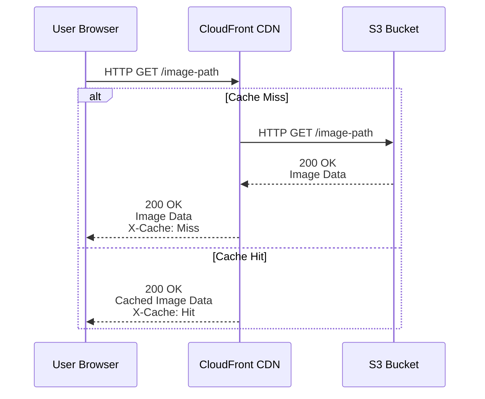

# AdvancedNodeStarter

Starting project for a course on Advanced Node @ Udemy

### Installation

- Run `npm install` in the root of the project to install the server's dependencies
- Change into the client directory and run `npm install --legacy-peer-deps`
- Change back into the root of the project and run `npm run dev` to start application

**Important** - the Mongo Atlas database credentials provided in `dev.js` are read only. If you attempt to login without using your own connection string (covered in the course) you will get the following error `[0] MongoError: user is not allowed to do action [insert] on [advnode.users]`

### S3 setup
- Step 1: Create bucket (like a folder) in S3
- Use IAM: create user credentials with limited access scope (only to S3)
  - Policy: `image-upload-app-admin-policy` describe what/who can read/write bucket `image-upload-app`
    - choose service s3
    - allow all actions
    - resources
      - bucket: `image-upload-app`
      - object: `image-upload-app/*` (all objects in the bucket)
  - User: `image-upload-app-admin`
    - Attach policy `image-upload-app-admin-policy`
- Manage:
  - https://658269753957.signin.aws.amazon.com/console
- CORS error uploading image to S3
  - S3 bucket > Permissions > CORS configuration
  - Add CORS configuration
```js
[
    {
        "AllowedHeaders": [
            "*"
        ],
        "AllowedMethods": [
            "GET"
        ],
        "AllowedOrigins": [
            "*"
        ],
        "ExposeHeaders": []
    },
    {
        "AllowedHeaders": [
            "*"
        ],
        "AllowedMethods": [
            "PUT"
        ],
        "AllowedOrigins": [
            "http://localhost:3000"
        ],
        "ExposeHeaders": []
    }
]
```
  - Save
- Access uploaded image: bucket > permissions > policy
```json
{
    "Version": "2012-10-17",
    "Id": "Policy1707235877663",
    "Statement": [
        {
            "Sid": "Stmt1707235867533",
            "Effect": "Allow",
            "Principal": "*",
            "Action": "s3:GetObject",
            "Resource": "arn:aws:s3:::image-upload-app/*"
        }
    ]
}
```
- Best practise
  - Store the path of the image in the database: `${user.id}/${filename}`
  - Link can be dynamically generated: `https://s3.amazonaws.com/image-upload-app/${user.id}/${filename}`

### depl to ec2
- EC2 > Launch an instance
- image-upload-server
- ssh to ec2
- setup docker
```sh
sudo amazon-linux-extras install docker
sudo usermod -a -G docker ec2-user
# logout and login again
sudo service docker start
sudo curl -L https://github.com/docker/compose/releases/latest/download/docker-compose-$(uname -s)-$(uname -m) -o /usr/local/bin/docker-compose
sudo chmod +x /usr/local/bin/docker-compose
docker-compose version
```
- setup git
```sh
sudo yum install git -y
git config --global user.name "Thanh Nguyen"
git config --global user.email "vnscriptkid@gmail.com"
ssh-keygen -t rsa -b 4096 -C "vnscriptkid@gmail.com"
eval "$(ssh-agent -s)"
ssh-add ~/.ssh/id_rsa
cat ~/.ssh/id_rsa.pub
ssh -T git@github.com
```

### Setup oauth
- Google
  - https://console.developers.google.com/
  - Create project
  - Credentials
    - Create credentials
    - OAuth client ID
    - Web application
    - Authorized JavaScript origins: http://photogram.store
    - Authorized redirect URIs: http://photogram.store/auth/google/callback
    - Create
    - Copy client ID and client secret

### Setup domain namecheap
- Buy domain name: photogram.store
- https://ap.www.namecheap.com/
- Dashboard > Domain List > Manage > Advanced DNS
- Add new record
  - Type: A Record
  - Host: @
  - Value: EC2 public IP
  - TTL: Automatic

### Setup CDN CloudFront
- Create distribution
    - Origin Domain Name: s3 bucket
- Configure S3 Bucket Policy
    - Bucket > Permissions > Bucket Policy
```json
{
  "Version": "2012-10-17",
  "Statement": [
    {
      "Effect": "Allow",
      "Principal": {
        "Service": "cloudfront.amazonaws.com"
      },
      "Action": "s3:GetObject",
      "Resource": "arn:aws:s3:::image-upload-app/*",
      "Condition": {
        "StringEquals": {
          "AWS:SourceArn": "arn:aws:cloudfront::YOUR_AWS_ACCOUNT_ID:distribution/EXAMPLE"
        }
      }
    }
  ]
}
```
- Update image url in react app
    - From: https://image-upload-app.s3.ap-southeast-1.amazonaws.com/xyz.jpeg
    - To: https://d1v7v7j7ef9v1.cloudfront.net/xyz.jpeg
- Test loading image in browser
    - First time: X-Cache: Miss from cloudfront
    - Second time: X-Cache: Hit from cloudfront
  
